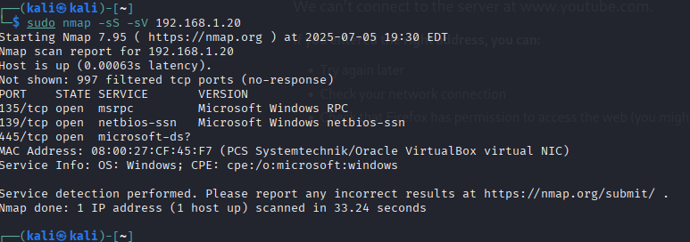

# Cybersecurity_Lab_Projects
This repo is specifically designed to contain the documentation of my Cybersecurity Lab 
---

# Project 1: Virtual Cybersecurity Lab Setup 

**Objective:** To simulate a secure, real-world environment for offensive and defensive security testing through Virtual Machines

### Tools Used for this virtual cybersecurity lab setup

| Operations    |  Tools    |
|----------------|----------------- |
| Hypervisor    | VirtualBox  |
| Operating Systems:|  Kali Linux, Windows |
| Service Enumeration |NMAP, Shared Folders |

### Activities

- Install a Type 2 Hypervisor
- Create and configure two  Virtual Machines
- Establishing internal virtual networking between VMs
- Verify Connectivity via Ping tests, Shared directories, and Service Enumeration

### Procedures
- Installation of Type 2 Hypervisor  
- Ensuring Virtual internetworking between VMs
- Verification of internal networking via ping tests
- Shared Files and Nmap Service Enumeration 

